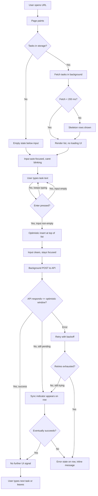
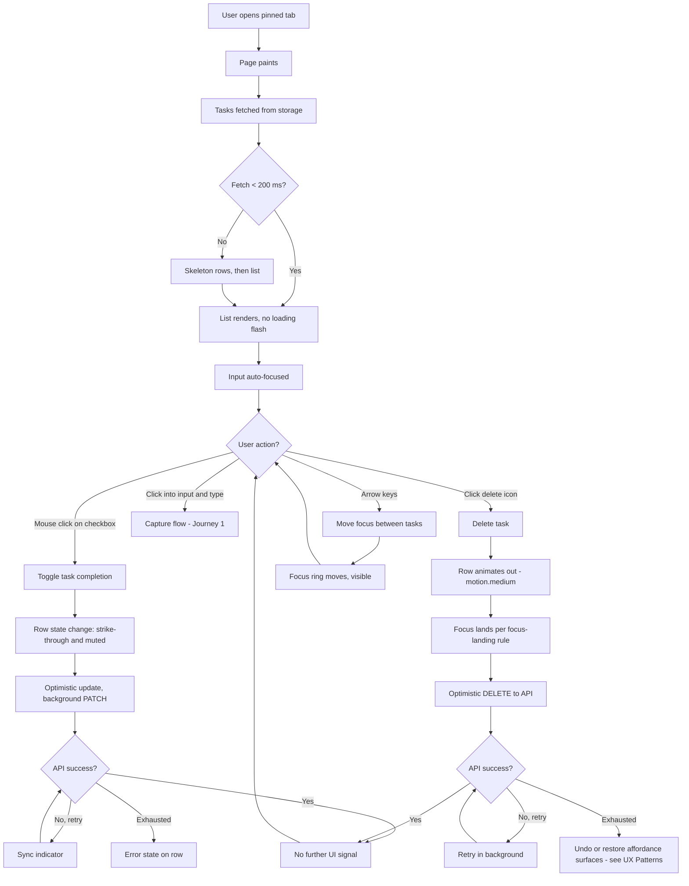
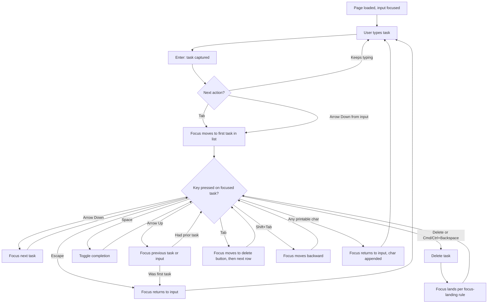
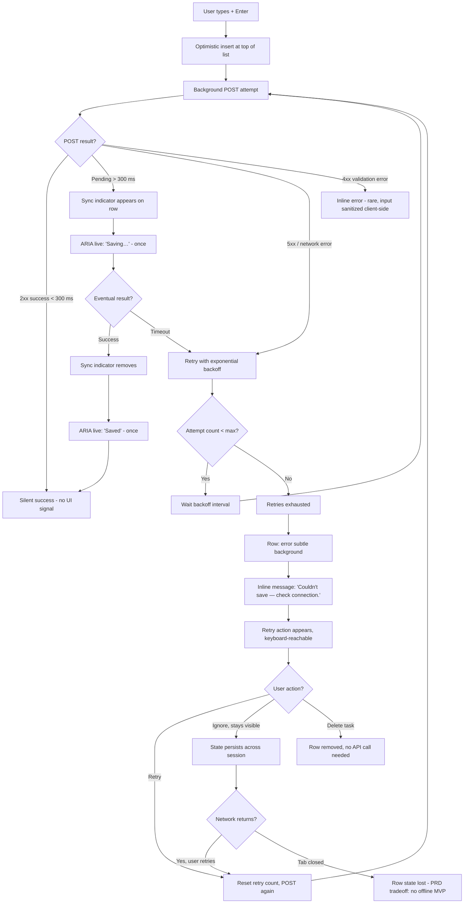

---
stepsCompleted:
  - step-01-init
  - step-02-discovery
  - step-03-core-experience
  - step-04-emotional-response
  - step-05-inspiration
  - step-06-design-system
  - step-07-defining-experience
  - step-08-visual-foundation
  - step-09-design-directions
  - step-10-user-journeys
  - step-11-component-strategy
  - step-12-ux-patterns
  - step-13-responsive-accessibility
  - step-14-complete
inputDocuments:
  - _bmad-output/planning-artifacts/prd.md
  - _bmad-output/planning-artifacts/prd-validation-report-2026-04-22.md
---

# UX Design Specification bmad-todo-app

**Author:** Tommy
**Date:** 2026-04-23

---

## Executive Summary

### Project Vision

bmad-todo-app is a deliberately minimal single-user task manager — a responsive web app against a REST API, with no accounts, no configuration, and no feature breadth. It is framed as an **Experience MVP**: the product validates whether a minimal capability set, executed to a polished bar, can feel like a *complete* product rather than a toy.

The differentiator is **speed**, expressed along two axes that this UX specification must hold equally:

- **Performance speed** — optimistic updates with no visible latency; ≤1s time-to-interactive; ≤100ms interaction budget at the 95th percentile.
- **Usability speed** — the full task lifecycle (add, complete, delete, navigate) is operable from the keyboard alone, with focus management treated as a first-class design surface.

A single, load-bearing rule governs all scope-pressure decisions in UX: **when scope pressure arrives, execute the existing scope more finely — do not add features**. Polish is MVP scope, not post-MVP.

### Target Users

The product serves a single primary persona — **Sam**, a self-employed designer who has tried and abandoned Todoist, Things, and Apple Reminders because each demanded its own ceremony (projects, sync configuration, multi-tap access). Sam wants a list that behaves like a sticky note he cannot lose.

Representative behaviors that the UX must accommodate without ceremony:

- Opens a browser tab mid-thought, types, hits Enter, closes the tab.
- Returns hours or days later and expects his tasks intact without sign-in.
- Eventually pins the tab and operates the app entirely by keyboard.
- Uses the app on flaky networks and trusts that no data is silently dropped.

Sam is tech-savvy with high expectations for tool responsiveness. He prefers the keyboard and will notice friction immediately.

### Key Design Challenges

1. **Making "minimal" read as "complete", not "unfinished."** This is the core design wager. Every state — empty, loading, error, focus, hover, sync-pending, completed, deletion — has to feel intentional. With so few surfaces, there is nowhere for polish slippage to hide.
2. **Delete safety without ceremony (FR10).** Confirmation dialogs break the keyboard flow; instant delete risks data loss; undo toasts add UI chrome. The right answer is a design decision, not a default.
3. **Sync-status indicator that is "non-intrusive" but not invisible (FR25).** It must be perceivable to screen readers (via ARIA live regions, FR22), visible enough to establish trust, and subtle enough not to become visual noise on every row.
4. **Keyboard-shortcut discoverability without onboarding.** The PRD rejects tour overlays but still requires the shortcut set (Enter, Space, Delete, arrows, Tab) to be self-evident. How shortcuts surface in context — without becoming a cheat-sheet — is an open design question.
5. **Completed-state visual that distinguishes active from done at-a-glance, without relying on color alone (WCAG 1.4.1, 1.4.3).** The conventional strike-through-plus-muted treatment must still meet 4.5:1 contrast in its muted form, which is easy to fail.

### Design Opportunities

1. **Focus-as-primary-navigation.** Most task apps treat keyboard as a secondary affordance. Here it is primary. Focus ring styling, focus-on-load, and focus-landing-after-delete become first-class design decisions rather than afterthoughts.
2. **State transitions as the polish surface.** Every mutation — add, toggle, delete, sync-pending → synced — is an opportunity for a tight sub-100ms micro-interaction that carries the "feels finished" signal at the moment of interaction.
3. **A single content column, typographically confident.** Minimal scope allows the layout to afford generous whitespace and strong typography instead of competing chrome. The visual language itself becomes the product's polish.

---

## Core User Experience

### Defining Experience

The product's core loop is **add → complete → delete**, but at this project's deliberately minimal scope the single defining interaction is **task capture**. On page load, the text input is already focused (FR18). The user types, presses Enter, and the task appears in the list below the input with no visible latency — no spinner, no confirmation, no server round-trip in the perceived path. This is the moment where the product either earns Sam's trust as a "sticky note I cannot lose" or loses it.

If capture is instant and durable, every other interaction in the product inherits that trust. If capture stutters, feels unsure, or introduces any doubt about persistence, nothing downstream can recover it. Every later UX decision in this specification is evaluated against whether it protects the quality of that one moment.

### Platform Strategy

- **Responsive single-page web app.** No native, no PWA, no service worker (MVP). Single view, no client-side routing required for MVP.
- **All breakpoint tiers co-equal in functionality**, but unequal in dominant interaction mode. The primary interaction surface designed for is the **desktop keyboard**; mobile is supported as a one-thumb capture surface rather than as a keyboard power-user surface.
- **Input priority order: keyboard-first, touch-supported, mouse-acceptable.** Focus management, shortcut choice, and focus-indicator styling are designed first-class; touch targets meet ≥44×44 px on mobile/tablet; mouse interactions are expected to work but are not the surface the design optimizes for.
- **No authentication, no onboarding, no configuration, no tour overlay.** The app is available the moment the page paints.
- **No offline support (MVP).** Network resilience is provided by optimistic UI plus background retry and an in-context sync indicator (FR23–FR27), not by a service worker or local-only mode.

### Effortless Interactions

Each of these must require zero deliberation from the user:

1. **"I open the tab and start typing."** The input is focused on page load. There is no modal, cookie banner, notification prompt, tour overlay, or sign-in gate between the user and the text field.
2. **"Press Enter, it's saved."** Optimistic append — the list updating is the confirmation. No spinner, no toast, no "Task added" announcement on the happy path.
3. **"Space toggles what I'm looking at."** The currently focused task accepts Space to toggle between active and completed. No mouse hover required, no click-target hunt.
4. **"Arrows move me through the list."** Up/Down arrow keys move focus between tasks, with no keyboard trap and no focus lost at list boundaries.
5. **"Delete removes it."** A dedicated delete affordance (Delete key or Cmd/Ctrl+Backspace, TBD in step 12) removes the focused task and lands focus predictably on the next logical task so the user can keep operating without re-locating.
6. **"Close the tab, come back, it's still there."** Durability is zero-ceremony. No manual save, no sync dialog, no "your data has been saved" reassurance banner.

### Critical Success Moments

These are the named moments where the design either delivers the product's promise or fails it. Each is later tested against real UI in the Playwright suite (NFR-M2) and accessibility audit.

1. **First keypress after page load** — the input must already be focused with a visible caret (FR18). Failing this fails Journey 1's opening move.
2. **First task appears** — the perceived gap between Enter and the task being visible must be under 100 ms (PRD Performance Targets). Any hint of latency here compromises the product's differentiator.
3. **Return visit** — tasks are present on reopen without a loading flash that makes the user wonder whether their data survived. Loading state is explicit only when needed; it is not a default.
4. **First completed task visible on return** — the visual distinction between active and done reads instantly, without parsing. Relying on color alone is a WCAG 1.4.1 failure *and* a comprehension failure.
5. **First delete** — no confirmation-dialog jank, no accidental-loss either. The FR10 safety pattern (to be decided in step 12) must feel deliberate and keyboard-native.
6. **First write failure** — the sync-status indicator appears inline on the affected task, the task remains in place, and there is no modal, red banner, or white-screen. The user's trust survives.
7. **Exhausted retry** — the error message names the failed operation and suggests a next action in context, without losing the user's typed text.

### Experience Principles

Five principles that every later UX decision in this document is bound against. When a later decision is ambiguous, the earlier-numbered principle wins.

1. **The app is already listening.** From the moment the page paints, the text input is focused and every core action is reachable without a mouse click or menu dive. No onboarding, no configuration, no chrome between the user and the text field.
2. **Interaction is the product.** With a deliberately minimal feature set, every keystroke and every state transition *is* the experience. Micro-interactions land under ~100 ms and feel intentional, not incidental.
3. **Keyboard is the primary surface.** Mouse and touch are supported, but focus management, shortcut choice, and focus-indicator styling are designed first and designed well. Focus is never lost, never trapped, never ambiguous.
4. **State changes are visible but never alarming.** Empty, loading, error, sync-pending, and completed states are explicit and legible — announced, not shouted. The app never white-screens and never uses a modal where a subtle in-place signal suffices.
5. **Polish over breadth, always.** When in doubt, sharpen an existing interaction rather than add a new one. Adding a feature is a scope regression; tightening a transition is a scope improvement.

---

## Desired Emotional Response

### Primary Emotional Goals

The primary emotional goal is **quiet trust** — the felt-sense of an object that gets out of the user's way. The product's most valuable emotional outcome is a near-absence of friction that the user notices only because every other task app they have tried failed to achieve it. The PRD states it directly: Sam *"registers the app as safe to throw thoughts into,"* and that is the whole emotional proposition the UX must deliver.

### Emotional Journey Mapping

| Stage | Desired feeling | What produces it |
|---|---|---|
| Page loads | "Oh — it's already ready." | Input focused, caret visible, no overlay, <1s time-to-interactive. |
| First task added | "…that was it?" | Optimistic append, no spinner, no toast, input clears and stays focused. |
| Return visit | "Still here." (barely conscious) | No loading flash when cache is warm, no sync dialog, tasks simply present. |
| Scanning the list | "I can see where I am." | Clear active vs. completed distinction, legible typography, no visual chrome competing for attention. |
| Completing a task | Small, private satisfaction. | Immediate visual shift (strike-through + muted), no fanfare, no celebration, no sound. |
| Deleting a task | "Handled." | Clean removal, predictable focus landing on the next logical task, safety mechanism (TBD, step 12) that does not break keyboard flow. |
| Network hiccup | "It noticed. I don't have to." | Inline sync-status indicator on the affected row, no modal, task stays visually in place. |
| Retry exhausted | "It's telling me the truth." | In-context message on the row, names the failed operation and next action, typed input preserved. |

### Micro-Emotions

**To produce:**

- **Competence** — the user feels sharper and faster when using the app, because the app is cleanly responsive. The keyboard flow should feel like a good terminal.
- **Focus** — the app disappears around the task. No sidebars, counters, or banners performing motivation.
- **Confidence** — the user always knows where their data is, where focus is, and what state each task is in, at a glance.
- **Permission to be brief** — the app is fine with a one-word task and a closed tab. It does not want to be a relationship.

**To avoid:**

- **Delight-theater** — confetti, celebratory animations, motivational strings ("Great job!"). An app that performs enthusiasm destroys trust.
- **Doubt** — about saving, about where focus is, about whether a keypress registered, about whether data survived a reload.
- **Guilt** — streaks, "you haven't been here in N days", overdue badges on tasks with no due date.
- **Anxiety** — red banners for transient errors, modal alerts, urgent-color chrome. The app never shouts.
- **Ceremony fatigue** — onboarding, cookie banners, feature tours, "what's new," preference panels to dismiss.

### Design Implications

- **Trust, not thrill.** → No celebratory animations. Transitions are functional (natural easing, roughly 120–180 ms), not performative. No sounds, ever.
- **Confidence at every focus state.** → A visible, high-contrast focus indicator on every interactive element, meeting WCAG 2.4.7 / 2.4.11. The user's eye never has to hunt for "where am I?"
- **Calm in failure.** → Sync-pending is communicated visually and to assistive technology (subtle icon plus ARIA live region announcement); it uses a low-emphasis treatment, never red. Retry-exhausted is inline on the row, uses neutral language, and names the next action.
- **Respect the brevity.** → No modals, no happy-path confirmation dialogs, no multi-step flows. A task is added in one keypress; a task is removed in one keypress (plus whatever safety mechanism we resolve for FR10).
- **Feeling finished.** → Generous whitespace, a single centered content column, confident typography — the layout should feel *composed*, not bare. Polish reads as care.

### Emotional Design Principles

1. **Design for trust, not excitement.** The app's goal is to disappear into the user's workflow. If a design choice makes the app more *noticeable* rather than more useful, it is wrong.
2. **Never perform for the user.** No fanfare on success, no scolding on absence, no copy that tries to make the user feel feelings. The product has no voice beyond utility labels and direct error messages.
3. **Reassure in silence.** Durability and success are communicated by the app simply *working* — the list updates, the caret stays where the user left it, tasks survive a reload. If we need to tell the user "it worked," it didn't.
4. **When something breaks, be honest and quiet.** Failures produce inline, non-alarming signals with clear next actions — never modals, never color-shock, never vague copy like "Oops!"
5. **Fast is a feeling, not a metric.** The perceptual quality of a sub-100 ms interaction is the primary emotional gift the app gives. Every other design choice must protect it.

---

## UX Pattern Analysis & Inspiration

### Inspiring Products Analysis

Five positive references and three explicit anti-references frame the design vocabulary. The anti-references are taken directly from the PRD's persona narrative (products Sam has tried and abandoned); the positive references are selected to match the emotional register established in the previous section.

**TodoMVC — the canonical minimal task app.**
Not a product so much as a cross-framework reference implementation. Worth engaging because it establishes the correct *shape* for this class of app: focused input at the top, list below, optimistic add, immediate toggle, durable storage. The design goal for bmad-todo-app is to start where TodoMVC ends — TodoMVC is functionally correct but visually and interactionally undercooked. Closing the gap between "TodoMVC-correct" and "feels finished" is the entire design opportunity.

**Linear — keyboard-first, calm, fast.**
The best modern reference for "keyboard is the primary surface." Every action has a shortcut; shortcuts are discoverable in context without a tour; focus states are confident; the app feels instant; the visual language is restrained rather than enthusiastic. Linear is also a useful reference for what *not* to over-borrow: its command palette and dense shortcut surface would be overkill at this scope.

**Superhuman — sub-100 ms feel, no ceremony.**
Reference for the emotional register of speed. Every interaction happens below the perception threshold. Error states are calm, there are no celebratory animations, and the product's polish comes from responsiveness and consistency rather than decoration. This is the felt-quality target for bmad-todo-app's add/toggle/delete interactions.

**Stripe Dashboard — quiet confidence.**
Reference for visual tone. Confident typography, generous whitespace, status and error states that are clear without being loud. No performance theater, no marketing copy in the product surface. Reads as a grown-up tool — the same register the product should carry.

**Raycast / Alfred — focus-on-open, no chrome.**
Reference for "the app is already listening." Open → caret blinking → the user types. No window chrome, no persistent navigation, no header. The interaction surface is near 100% of the frame. This is the model for bmad-todo-app's load-time posture.

**Anti-references (from PRD persona narrative):**

- **Todoist** — projects, filters, tags, priorities, karma. Every feature is a new ceremony the user has to hold in mind. We adopt the *shape* of a task list and reject the weight of its taxonomy.
- **Things** — visually beautiful but demands sync configuration and assumes an ongoing relationship with the app. We reject *app-as-relationship*.
- **Apple Reminders** — the list is buried behind multiple taps. We reject any hierarchy that puts chrome between the user and the input.

### Transferable UX Patterns

**Interaction patterns to adopt:**

- **Focus-on-load with blinking caret** (Raycast, Alfred) — the product is immediately usable without a click.
- **Optimistic mutation with no toast confirmation** (Linear, Superhuman) — the list updating *is* the confirmation.
- **Inline, row-level state signaling** (Linear, Stripe) — sync-pending and error states attach to the affected row rather than occupying a global banner.
- **Visible, high-contrast focus ring on every interactive element** (Linear) — the user's eye never has to search for focus.
- **Keyboard-shortcut discoverability through in-context hints rather than a tour** (Linear) — shortcuts surface on hover/focus or as subtle secondary labels, never as a mandatory overlay.
- **Predictable focus landing after destructive actions** (Linear, Gmail web) — deleting a task moves focus to the next logical task so the user can continue without re-orienting.

**Visual patterns to adopt:**

- **Single centered content column with generous whitespace** (Stripe, Linear marketing, writing apps like iA Writer) — the layout does the work of signalling "composed," not "feature-rich."
- **Restrained, confident typography hierarchy** (Stripe, Superhuman) — one primary typeface, 2–3 weights, used with intent. No decorative type.
- **Neutral, low-contrast chrome and high-contrast content** (Linear, Stripe) — content is the foreground; everything else recedes.
- **Completed-state treatment that combines strike-through *and* reduced emphasis** (Things, Apple Reminders *where it works*) — never color-only (WCAG 1.4.1).

**Patterns to adapt (not lift wholesale):**

- **Command palettes / dense shortcut surfaces** — adapted *down* to a minimal shortcut set (Enter, Space, Delete, arrows, Tab) because this app does not have enough actions to justify a palette.
- **Superhuman's performance discipline** — adapted to the actual action set; there are only three user mutations, so "fast" is a consistent per-action budget (≤100 ms) rather than an elaborate performance architecture.

### Anti-Patterns to Avoid

Patterns that conflict with this product's principles and are therefore explicitly out-of-scope regardless of how common they are in the category:

- **Feature-discovery overlays, coach marks, or product tours on first load.** Violates *the app is already listening*.
- **Confirmation dialogs on routine destructive actions in the happy path.** Breaks the keyboard flow required by Journey 3 and introduces ceremony the minimal-scope doctrine rejects.
- **Toast notifications for routine success ("Task added!").** Violates *never perform for the user*; the list updating is sufficient confirmation.
- **Streaks, gamification, motivational strings ("Great job!", "You're on fire!").** Violates *design for trust, not excitement*.
- **Red banners or modal alerts for transient network errors.** Violates *when something breaks, be honest and quiet*; sync-pending state attaches to the row, never to the window.
- **Color-only state signaling** (for example, green rows = completed). WCAG 1.4.1 violation and a comprehension failure at a glance.
- **Empty-state illustrations with marketing copy** ("Let's get productive together!"). Space-filling content that reads as performance rather than utility; empty state is informative, not persuasive.
- **Settings / preferences panels for an app with nothing meaningful to configure.** Creates the illusion of features, adds a dismissal tax, and opens a scope-creep vector.
- **Persistent left-nav, sidebar, or breadcrumb chrome** in a single-view product. Any navigation chrome at MVP scope is dishonest — there is only one place to be.
- **Projects, tags, filters, priorities, due dates, reminders at MVP.** All explicitly deferred by the PRD to Growth / Vision.

### Design Inspiration Strategy

**What to adopt directly:**

- Focus-on-load with visible caret (Raycast).
- Optimistic mutation with no toast (Linear, Superhuman).
- Inline row-level state signaling for sync and error (Linear, Stripe).
- Visible high-contrast focus ring everywhere (Linear).
- Single centered column, generous whitespace, confident typography (Stripe, iA Writer, Linear).

**What to adapt:**

- TodoMVC's shape — keep the structural pattern (focused input above list), reject its visual undercooking.
- Superhuman's speed register — apply the ≤100 ms perceptual budget to add / toggle / delete, without adopting its feature density.
- Things' completed-task treatment — combine strike-through with reduced emphasis, but validate contrast of the muted state against WCAG 1.4.3.

**What to avoid deliberately:**

- Todoist's taxonomy weight (projects, tags, priorities).
- Things' assumption of an ongoing relationship (sync setup, preference config).
- Apple Reminders' burial of the list behind hierarchy.
- Category-standard gamification (streaks, karma, celebratory animation) from all of the above plus most consumer task apps.

---

## Design System Foundation

### 1.1 Design System Choice

**Custom, minimal design system — token-first, no third-party component kit.** Accessibility primitives owned directly rather than inherited from a library. A headless a11y primitive (e.g. Radix Toast) may be introduced later for a single narrow purpose if the FR10 delete-safety resolution in step 12 requires it, but the default posture is zero dependency on a visual component library.

### Rationale for Selection

1. **The component surface is tiny.** Five primary components — task input, task list, task row, state blocks (empty / loading / error), and sync-status indicator — with a possible sixth (undo or snackbar) depending on the FR10 decision. A custom system at this cardinality is tractable to own and easier to get *right* than to retrofit a kit to.
2. **The target visual register matches a minimal token system, not a component library.** Generous whitespace, confident typography, a restrained neutral palette with one accent, and a high-contrast focus system are expressed through **design tokens** (typography scale, spacing scale, color, radii, motion durations). Tokens compose into a consistent look across any component set. Component libraries impose the opposite order: opinionated component shapes first, tokens bolted on second.
3. **Accessibility obligations are narrow and behavioral.** The keyboard and ARIA obligations (FR14–FR22, NFR-A1) live mostly at the row level — focus management, Space / Delete / arrow handlers, live regions for sync status. These are small amounts of bespoke behavior that are simpler to own directly than to wrap around third-party primitives.
4. **Bundle budget (≤100 KB main chunk gzipped, PRD Performance Targets).** A custom system built from design tokens plus utility-scale CSS keeps the main chunk comfortably inside the budget. A full component kit plus its runtime routinely exceeds it on its own.
5. **Dependency-cap alignment (NFR-M5, ≤25 direct deps per package).** Every prebuilt component we don't use is still dead weight to audit, upgrade, and count against the cap. Importing a component kit to render five components is a scope regression.
6. **Scope doctrine.** The PRD's "execute the existing scope more finely, don't add features" principle applies to dependencies as much as to product features.

### Implementation Approach

**Decisions authoritative in this spec:**

- **Token-first.** Color, typography, spacing, radii, elevation/shadow, and motion are defined as tokens in the Visual Foundation section (step 8). Every component consumes tokens; no one-off values live in the component layer.
- **Small component vocabulary** — the complete set is enumerated in the Component Strategy section (step 11). Each component owns its own states (default, hover, focus, active, disabled, pending, error) against the tokens.
- **Single visual register** per the Inspiration section: restrained, typographic, high-contrast. One primary typeface, two or three weights, a neutral-centric palette with one accent hue used sparingly.
- **Accessibility baked into the component definitions, not applied as a later pass.** Focus visible at ≥3:1 contrast, non-color state signalling, programmatic labels, ARIA live regions where relevant.

**Decisions deferred to the architecture phase (not overridden here):**

- Specific CSS approach (utility-first framework such as Tailwind, CSS Modules, vanilla-extract, etc.). The tokens and components in this spec map cleanly to any of them.
- Whether to import a narrow headless accessibility primitive (for example, Radix Toast or equivalent) for the FR10 delete-safety UI, if that resolution requires one.
- Specific application framework (React / Solid / Svelte / etc.) — affects component syntax but not the design-system definition.

The design system in this specification is authoritative on tokens, components, states, and behaviour; the architecture phase selects the tooling that expresses it.

### Customization Strategy

Because the system is custom-and-minimal, there is no "customization" in the component-kit sense. Extension is handled through three disciplines:

- **Token changes are the extension surface.** Changing a token — for instance, adjusting the muted-completed color to maintain WCAG 1.4.3 contrast — propagates to every component automatically. Token edits are the primary way the system evolves.
- **New components are added only when a concrete MVP requirement surfaces them.** No speculative components (modal, drawer, menu, popover, etc.) are built ahead of a real need. This protects the scope doctrine from quietly eroding inside the component layer.
- **Growth-phase readiness is implicit.** Post-MVP features named in the PRD (filter, bulk actions, priority, due dates, keyboard-shortcut overlay) compose from the token and component structure without needing a commitment to specific UI now. A minimal token system generalizes into Growth features more cleanly than an opinionated component kit does.

---

## 2. Core User Experience

### 2.1 Defining Experience

The defining experience is **capturing a task in one keystroke**. Page loaded → caret already blinking in the input → type → press Enter → task appears with no visible latency → input clears, ready for the next thought. If this single interaction feels instant, durable, and unceremonial, the product's whole promise ("a sticky note I cannot lose") is delivered. Every other interaction — toggle, delete, navigate — inherits the trust or suspicion established here.

The differentiator is not the action itself; TodoMVC demonstrates the action. The differentiator is the **execution quality** of the action: perceptual latency below 100 ms, no spinner, no toast, no modal, focus never leaving the input, and data durable without any explicit "Save" gesture.

### 2.2 User Mental Model

The user brings three prior mental models to capture:

1. **Paper or sticky note.** Thought arrives → write it down → move on. No intermediate ceremony. Retrieval is eyes-on. The note is trusted because it is physical. The app must earn the same trust without being physical.
2. **Browser address bar or search box.** Focus is implicit (Cmd-L, or already focused on a new tab), typing produces a result immediately, Enter commits, the field is ready again. This is the interaction register the task input should evoke.
3. **Fast keyboard apps in their adjacent workflow** (Superhuman, Raycast, Linear). Expectations: sub-100 ms response, every action has a shortcut, no "tip of the day" chrome, focus state is always visible, errors are informative not alarming.

**Where the mental model can break:**

- A spinner after Enter reads as "the app is network-gated and slow."
- A task that appears and then animates into position reads the animation as latency.
- An input that loses focus after submission forces a click for the next task — breaking the paper-note model on the second thought.
- Any confirmation ("Task added") announces the app at the moment it should have disappeared.
- A loading flash on return visits plants doubt that the data survived.

Stated simply: **typing into this should feel like typing into a search box, and the result should feel as durable as writing on paper.**

### 2.3 Success Criteria

Capture has succeeded when each of the following is true:

1. **Time-to-first-keypress-accepted from page load is ≤1 s** (Lighthouse TTI; PRD Performance Targets).
2. **Perceived latency from Enter to task visible is ≤100 ms** at the 95th percentile (PRD Performance Targets).
3. **Input remains focused after submission** — no click or Tab required to capture the next task.
4. **Input clears on successful submit** — no manual selection or delete of the previous text.
5. **No confirmation UI fires on the happy path** — no toast, no banner, no animation longer than the design-system motion primitive allows.
6. **Optimistic append is visually indistinguishable from a persisted task** — the user has no cue that the server has not confirmed yet, unless the write fails (in which case the sync indicator surfaces).
7. **Failed writes do not silently lose typed input** — the task remains visible with a sync-pending indicator until retry resolves or exhausts (FR23–FR27).
8. **Return visit shows tasks without a visible loading flash when the cache is warm.** An explicit loading state appears only when the fetch is genuinely pending beyond a minimum threshold (below ~200 ms, no indicator; above, an explicit skeleton or subtle spinner).
9. **The interaction shape is identical on mobile touch and desktop keyboard** — focus → type → submit — with touch-appropriate affordances (≥44×44 px touch targets, no hover dependencies).

Failure modes to regression-test against: spinner on submit, focus lost after submission, input not clearing, confirmation toast firing, noticeable animation between Enter and task appearing, loading flash on reload, silent loss of a failed write.

### 2.4 Novel UX Patterns

**This is deliberately established territory, not novel.** All five pattern families used here are well-documented in adjacent products:

- **Focus-on-load with auto-focused input** — standard (search boxes, chat apps, command palettes).
- **Enter-to-submit with input-clears-after-submit** — standard (IRC, Slack, chat apps, TodoMVC).
- **Optimistic mutation with background sync** — standard (Linear, Superhuman, Google Docs, modern data-fetching libraries such as TanStack Query and SWR).
- **Non-intrusive inline sync-status indicator** — standard (Google Docs' "Saving… / All changes saved", Linear's inline row states).
- **Durable server-side persistence without explicit save** — standard (Gmail drafts, Notion, Google Docs).

**There is no novel interaction to teach.** The design opportunity is not pattern invention but *pattern execution quality*. Every element here is a combination of patterns the user already knows from adjacent tools; the product wins by assembling them with unusual discipline and by *not* adding a sixth pattern the category usually throws in (confirmation toast, streak counter, onboarding tour).

Choosing established patterns is deliberate. It aligns with "design for trust, not excitement" (Emotional Design Principle 1) and with the PRD's scope doctrine ("polish over breadth"). The user should feel familiarity, not novelty.

### 2.5 Experience Mechanics

Step-by-step specification of the capture interaction. This is the canonical contract that later implementation stories honour.

**1. Initiation**

- Page loads. The task list renders — either with server-provided data or, if the fetch exceeds the minimum threshold (~200 ms), with an explicit skeleton.
- The text input is rendered at the top of the content column and receives focus automatically on mount (FR18). The caret is visible.
- No competing element claims initial focus — no banner with a dismissible X, no modal, no menu. The input is the only focus candidate on load.
- Placeholder text is minimal and specific (for example, *"What needs doing?"*). It is not motivational, not an instruction, and not empty.

**2. Interaction**

- The user types. Character-by-character behaviour follows the browser default — no debouncing, no inline suggestions, no per-keystroke validation.
- Input accepts up to 500 characters (FR1). Approaching the limit produces a subtle counter or soft-wrap affordance (exact treatment resolved in the Component Strategy section); exceeding the limit is prevented at the input level, not rejected after submission.
- **Enter** commits. Empty or whitespace-only submissions are no-ops: no error appears, the input is not cleared, the key simply does nothing.
- **Shift+Enter** is reserved as a no-op at MVP. A future multiline-task mode is out-of-scope.
- Touch submission uses the identical sequence: a submit affordance (an explicit button or the on-screen keyboard's Enter) triggers the same commit behaviour as desktop Enter.

**3. Feedback**

- On Enter, the task appears at the appropriate list position (ordering resolved in the User Journeys section) *before* the network round-trip resolves — optimistic append (FR23).
- The input clears immediately and remains focused.
- No toast fires. No banner fires. No animation beyond the design-system motion primitive (approximately 120–180 ms, ease-out) accompanies the insertion. The insertion is a state change, not a celebration.
- If the write succeeds in the background, there is no additional UI signal — the **absence of a sync indicator is itself the success signal**.
- If the write remains pending beyond the optimistic window, the affected row displays the sync-pending indicator (FR25): subtle, inline, and announced to assistive technology via an ARIA live region (FR22, NFR-A3).
- If the write fails permanently after retry exhaustion, the row surfaces a retry-exhausted state inline with an actionable message that names the failed operation and suggests a next action (FR26). The typed text is never discarded.

**4. Completion**

- The user knows capture is complete when the list contains the task and the input is empty-and-focused, ready for the next one.
- Completion is silent. The app does not announce success.
- The "next" is implicit: the user either types another task or leaves the tab. Either outcome is correct and equally respected by the app.

---

## Visual Design Foundation

No external brand guidelines are in scope. The visual foundation is grounded in the emotional register (quiet trust, "design for trust, not excitement") and the inspiration set (Stripe, Linear, Superhuman, iA Writer) — restrained, typographic, high-contrast. Both **light and dark themes** are in scope at MVP, honouring `prefers-color-scheme`; the OS setting is the authority and no user-facing theme toggle is shipped.

### Color System

**Strategy: neutral-centric palette, one accent, restrained.** A neutral greyscale carries content and chrome; a single accent hue is reserved for two places only — the focus ring and the caret. Status colors are narrow and muted, appearing in failure-path UI exclusively and never to celebrate success.

**Light theme tokens:**

| Token | Value | Role |
|---|---|---|
| `color.bg.canvas` | `#FAFAFA` | Page background |
| `color.bg.surface` | `#FFFFFF` | Content surface (input, card backgrounds) |
| `color.bg.subtle` | `#F4F4F5` | Hover / subtle row emphasis |
| `color.border.default` | `#E4E4E7` | Input borders, dividers |
| `color.border.strong` | `#A1A1AA` | Hover border, placeholder affordance |
| `color.text.primary` | `#18181B` | Active task text, headings, input value |
| `color.text.secondary` | `#52525B` | Placeholder, meta, helper text |
| `color.text.muted` | `#71717A` | Completed-task text (4.91:1 on canvas) |
| `color.text.disabled` | `#A1A1AA` | Disabled UI (rare at MVP) |
| `color.accent.default` | `#2563EB` | Focus ring, caret, primary interactive accent |
| `color.accent.subtle` | `#DBEAFE` | Focus ring halo, accent surface |
| `color.status.pending` | `#A1A1AA` | Sync-pending indicator (neutral, not warning) |
| `color.status.error` | `#B91C1C` | Retry-exhausted inline state |
| `color.status.error.subtle` | `#FEE2E2` | Error surface background, used sparingly |

**Dark theme tokens:**

| Token | Value | Role |
|---|---|---|
| `color.bg.canvas` | `#09090B` | Page background |
| `color.bg.surface` | `#18181B` | Content surface |
| `color.bg.subtle` | `#27272A` | Hover / subtle row emphasis |
| `color.border.default` | `#27272A` | Borders, dividers |
| `color.border.strong` | `#52525B` | Hover border |
| `color.text.primary` | `#FAFAFA` | Active task text |
| `color.text.secondary` | `#A1A1AA` | Placeholder, meta |
| `color.text.muted` | `#71717A` | Completed-task text (4.52:1 on canvas) |
| `color.text.disabled` | `#52525B` | Disabled |
| `color.accent.default` | `#60A5FA` | Focus ring, caret |
| `color.accent.subtle` | `#1E3A8A` | Focus halo |
| `color.status.pending` | `#71717A` | Sync-pending |
| `color.status.error` | `#F87171` | Retry-exhausted inline state |
| `color.status.error.subtle` | `#450A0A` | Error surface background |

**Contrast validation:**

- `text.primary` on `bg.canvas` — light 16.8:1, dark 17.9:1 (passes AA Normal and AAA).
- `text.muted` on `bg.canvas` (the critical completed-task case) — light 4.91:1, dark 4.52:1 (passes AA Normal). This is the token most likely to break in implementation; any muted-completed treatment must re-validate against its actual rendered background (including `bg.subtle` on hover).
- `accent.default` as focus indicator on `bg.canvas` (WCAG 2.4.11, 3:1 obligation) — light 4.56:1, dark 4.88:1 (passes).
- `border.default` against `bg.canvas` is deliberately below 3:1 — borders are not interactive focus indicators; the focus ring is.

**Explicit exclusions:** no green "success" color (no success UI exists in the happy path), no yellow/amber caution (sync-pending is neutral grey — that is the whole point), no gradient accents, no brand-color flourishes. The accent blue is reserved for focus and caret; widening its use dilutes its focus-ring meaning.

### Typography System

**Strategy: one typeface, two weights in practical use, a compact scale.** With a single content type (short task descriptions) and minimal chrome, a type scale beyond ~five steps is over-engineering.

**Typeface stack:**

```css
font-family: "Inter", ui-sans-serif, system-ui, -apple-system, BlinkMacSystemFont,
             "Segoe UI", Roboto, "Helvetica Neue", Arial, sans-serif;
```

Inter is used when available (self-hosted variable font, woff2, Latin subset — approximately 28 KB, loaded with `font-display: swap`); falls back to the OS system font stack. Both paths produce the target register. If the architecture phase needs further cuts, dropping Inter for the system stack alone is acceptable — the design survives the choice. No second typeface is supported.

**Type scale (rem-based, 1rem = 16 px):**

| Token | Size | Line-height | Weight | Usage |
|---|---|---|---|---|
| `text.display` | 1.5rem (24 px) | 1.3 | 600 | Reserved for growth; no MVP surface uses it |
| `text.heading` | 1.125rem (18 px) | 1.4 | 600 | Reserved for growth; unused at MVP |
| `text.body` | 1rem (16 px) | 1.5 | 400 | Task text, input text — the primary type |
| `text.body.strong` | 1rem (16 px) | 1.5 | 500 | Rare; e.g. an undo action label if that FR10 pattern is chosen |
| `text.meta` | 0.875rem (14 px) | 1.4 | 400 | Helper text, empty-state copy, error messages, sync-status label |
| `text.caption` | 0.8125rem (13 px) | 1.3 | 400 | Character counter, shortcut hints — smallest permitted size |

**Rules:**

- No type token below 13 px, including counters and hints — zoom headroom matters.
- Line-heights are unitless ratios, not pixels, so they scale under font-size zoom (WCAG 1.4.4 requires functionality up to 200%).
- Letter-spacing uses the font default; no tracking adjustments.
- Weights actually used at MVP: 400 (regular) and 600 (semibold). 500 (medium) is reserved for the single case above and may not be needed.

### Spacing & Layout Foundation

**Strategy: 4 px base unit, centered single content column, generous whitespace.**

**Spacing tokens:**

| Token | Value | Common usage |
|---|---|---|
| `space.0` | 0 | — |
| `space.1` | 4 px | Icon-to-text, focus-ring offset |
| `space.2` | 8 px | Tight row padding, small gaps |
| `space.3` | 12 px | Row vertical padding baseline |
| `space.4` | 16 px | Row horizontal padding, grouped elements |
| `space.5` | 20 px | Section dividers |
| `space.6` | 24 px | Content block gaps |
| `space.8` | 32 px | Section gaps, input-to-list gap |
| `space.10` | 40 px | Page top padding (Compact tier) |
| `space.12` | 48 px | Page top padding (Expanded tier) |
| `space.16` | 64 px | Page top padding (Large tier and above) |

The 4 px base lets the row height hit the **44 px touch target natively** (11 × 4) without ad-hoc sizes: `space.3` vertical padding (×2) plus a 1rem text line-height yields a ≥44 px hit region on mobile.

**Layout structure:**

- **Single centered content column.** No sidebar, no header chrome, no footer at MVP.
- **Max content width: 640 px.** The reading column applies at the Expanded tier and above. Wider viewports receive whitespace, not wider content — per PRD: *content does not stretch to fill viewport*.

**Responsive behaviour by tier** (PRD breakpoints):

| Tier | Column width | Outer padding | Top padding |
|---|---|---|---|
| Compact (0–599) | 100% | `space.4` (16 px) | `space.10` (40 px) |
| Medium (600–899) | 100%, max 560 px | `space.6` (24 px) | `space.10` (40 px) |
| Expanded (900–1199) | max 640 px, centered | auto | `space.12` (48 px) |
| Large (1200–1799) | max 640 px, centered | auto | `space.16` (64 px) |
| Extra-large (1800+) | max 640 px, centered | auto | `space.16` (64 px) — unchanged |

**Radii:**

| Token | Value | Usage |
|---|---|---|
| `radius.sm` | 4 px | Input corners, subtle surface corners |
| `radius.md` | 6 px | Task row corners (if boxed), button corners |
| `radius.full` | 9999 px | Circular affordances — reserved, rare at MVP |

**Motion:**

| Token | Duration | Easing | Usage |
|---|---|---|---|
| `motion.instant` | 0 ms | — | State changes that must not animate — optimistic task insertion, success-path commit |
| `motion.short` | 120 ms | `ease-out` | Focus ring, hover fade, micro-transitions |
| `motion.medium` | 180 ms | `ease-out` | Row fade-out on delete, sync indicator appearance |
| `motion.long` | 240 ms | `ease-out` | Reserved — not used at MVP |

- All motion tokens must respect `prefers-reduced-motion`. When reduced-motion is set, every non-instant duration collapses to `motion.instant`.
- **Critical rule: task insertion on successful capture uses `motion.instant`.** Any animation on insert introduces perceived latency on the happy path and violates Success Criterion 2 in the Core User Experience section.

### Accessibility Considerations

- **Contrast load-bearing token:** `text.muted` on `bg.canvas` is the most fragile contrast case and must be re-validated against any alternative background — in particular `bg.subtle` on row hover.
- **Focus indicator:** 2 px solid `accent.default` with a 2 px offset. Effective halo meets ≥3:1 against all surfaces in both themes (WCAG 2.4.11). The focus indicator is never removed, never replaced by an outline-only visual that may fail against specific surfaces.
- **Non-color state signalling:** completed-task uses strike-through *and* `text.muted` (two signals, WCAG 1.4.1). Sync-pending uses an icon *and* an ARIA live region announcement (FR22).
- **Zoom & reflow:** 16 px base with rem-scaled sizes and unitless line-heights preserves functionality at 200% zoom (WCAG 1.4.4). Single-column layout reflows without horizontal scroll (WCAG 1.4.10).
- **Reduced motion:** honoured per the motion section above.
- **Theme authority:** dark mode is driven entirely by `prefers-color-scheme`. No user-facing theme toggle ships at MVP — the OS setting is the source of truth, and one less settings temptation is one less scope-creep vector.

---

## Design Direction Decision

### Design Directions Explored

A conventional "generate 6–8 variations and pick one" exploration was considered and rejected at this step. Preceding sections (Inspiration, Core User Experience, Visual Foundation) converged on a single, internally consistent direction early enough that exploring multiple alternatives would have produced either near-identical variants or artificially-differentiated ones — both outcomes violating the PRD's scope doctrine ("polish over breadth, always").

Instead, the single converged direction was consolidated into concrete visual choices and validated through a static HTML preview file (`_bmad-output/planning-artifacts/ux-design-preview.html`) showing the direction applied to empty, populated, loading, and responsive states in both themes. The preview is a one-shot review artifact, not a maintained asset.

### Chosen Direction

**A single centered column of divider-separated task rows, with a circular checkbox on the left, task text flush-left in the middle, and a delete affordance on the right that remains quiet until the row is hovered or focused.** The input above the list shares the row rhythm. No card backgrounds, no shadow chrome, no illustrations — whitespace, typography, and the focus ring carry the visual weight.

Concrete visual choices (authoritative):

**Task row**

- Borderless row, 1 px bottom divider in `color.border.default`. No card background in the default state, no elevation.
- Row height ≥ 44 px, composed of `space.3` top/bottom padding (12 px × 2) plus 1rem text line-height.
- Layout: `checkbox | text (grows) | inline status | delete`, flex row, gap `space.3`.
- Row horizontal padding: `space.4` on Compact tier, `space.2` on Expanded and above (column is narrower than the viewport, reducing needed inner padding).

**Checkbox affordance (task completion)**

- Circular, 20 × 20 px, 2 px border in `color.border.strong`.
- Empty (active task): transparent fill, `color.border.strong` border.
- Filled (completed): solid `color.accent.default` background with an inset white checkmark icon.
- Hover: border transitions to `color.accent.default`.
- Focus: 2 px `color.accent.default` outer focus ring with 2 px offset.
- The entire row accepts Space to toggle when focused; the checkbox is the visual affordance, not the sole hit target.

**Task text**

- Active: `text.body`, weight 400, color `color.text.primary`. Wraps to at most two lines before truncation with ellipsis.
- Completed: `color.text.muted` with `text-decoration: line-through` at `text-decoration-thickness: 1px`. Weight unchanged. Strike-through and color shift together are the two non-color signals (WCAG 1.4.1).
- Transition between active and completed: `motion.short` (120 ms ease-out) on color and decoration.

**Delete affordance**

- Trash icon, 16 × 16 px, on the right edge of the row.
- Desktop default: opacity 0 (present in DOM and tab order; visually hidden).
- On row hover or row focus: opacity 1, color `color.text.muted`.
- On icon hover or focus: color `color.status.error`.
- Touch devices (`@media (hover: none)`): always visible at `color.text.muted` — with no hover state available, a hidden affordance would be undiscoverable.
- The keyboard delete shortcut on the focused row (specific key resolved in the UX Patterns section) is authoritative; the icon is a mouse/touch surface, not the keyboard path.

**Input**

- Full content-column width, 48 px height (≥44 px target).
- Padding: `space.4` horizontal, `space.3` vertical.
- Border: 1 px `color.border.default`, `radius.sm` (4 px).
- Focus: 2 px `color.accent.default` ring with 2 px offset; border transitions to `color.border.strong`.
- Placeholder: `color.text.secondary`, copy: *"What needs doing?"*
- Caret: `color.accent.default`.
- Below-input affordance — **character counter** — appears only at ≥ 400 characters (80% of the 500-char limit), right-aligned, `text.caption`, `color.text.secondary`. Below 400, nothing appears.

**Sync-pending indicator**

- Placement: inline, between task text and delete affordance.
- Visual: 14 × 14 px dashed circle rotating on a 1.5 s loop. Color: `color.status.pending` — neutral grey, not warning amber.
- An ARIA live region (`aria-live="polite"`) announces *"Saving…"* on first appearance and *"Saved"* on resolution (FR22).
- Under `prefers-reduced-motion: reduce`: the rotation is removed; the static dashed circle remains and the ARIA announcement carries the semantic.

**Retry-exhausted error state**

- Row background: `color.status.error.subtle`.
- Inline message below task text: `text.meta`, `color.status.error`, copy: *"Couldn't save — check connection."*
- A text action (*Retry*) right-aligned at `text.meta`, weight 500, `color.accent.default`, keyboard-reachable.
- The task text itself remains at `color.text.primary` — the failure is about saving, not about the content.

**Empty state**

- Centered in the list area (not the full page).
- Single line: *"No tasks yet. Start by typing above."*
- `text.body`, `color.text.secondary`.
- No illustration, no icon, no button — the input above the list is the call to action.

**Loading state**

- Shown only when the initial fetch exceeds ~200 ms.
- Three skeleton rows matching row dimensions.
- Skeleton fill: `color.bg.subtle` with a subtle shimmer (linear gradient, `motion.medium` cycle).
- Under `prefers-reduced-motion: reduce`: static `color.bg.subtle` fills, no shimmer.

**Page structure (any viewport)**

- Vertical: `input | list (or empty/loading/error state)`.
- Gap between input and list: `space.8` (32 px).
- No header, no footer, no sidebar, no page title. The browser tab title carries the app name; the page surface is 100% interaction.

### Design Rationale

1. **Divider-separated rows over cards** — cards pull visual weight away from content and read as chrome. The list is the product; the list's visual should be the list, not a collection of boxes.
2. **Circular checkbox on the left** — canonical task-list affordance (Things, Linear, Apple Reminders). No novelty tax.
3. **Delete quiet until focused or hovered** — keeps the default list scan calm; the delete action is still one keystroke (or one tab-stop) away when needed. Always visible on touch because the hover state does not exist there.
4. **No card, no shadow, no illustration** — minimal scope generalizes into visual minimalism. Every piece of chrome we add would need its own polish budget (shadow tuning, card padding variants, illustration states) and compete with the speed-of-content register the product is trying to carry.
5. **Single content column with max 640 px** — reading width optimized for task text, generous whitespace at larger viewports reinforces the "composed, not bare" reading the layout needs.
6. **All the failure-path treatments are inline and row-local** — consistent with "when something breaks, be honest and quiet." No banners, no modals, no global chrome for transient failure states.

### Implementation Approach

- All visual choices above are expressed through the design tokens established in the Visual Design Foundation section; no token-bypass values are permitted in the component layer.
- The HTML preview file is reference-only, not a library asset. The architecture phase may use it as a visual contract but should not import from it.
- Component-level specifications (states, props, ARIA attributes) are formalized in the Component Strategy section (step 11).
- Interaction specifics — keyboard shortcut keys, delete safety pattern (FR10), focus-landing-after-delete rule — are formalized in the UX Patterns section (step 12).

---

## User Journey Flows

The PRD documents four user journeys narratively (first-time capture, daily list management, keyboard-only flow, error recovery). This section produces the mechanics-level interaction flow for each — step-by-step behaviour, decision branches, and error paths — and resolves two decisions that earlier sections deferred.

### Decisions Locked in This Section

**Task ordering: newest-first, single list, completion does not re-sort.**

All tasks occupy a single list. A newly added task appears at the top. Completing a task is a row-level state change (strike-through and muted color) that does *not* change the task's position in the list.

Rationale:

- The primary persona's mental model is scratchpad, not project management. Newest-first aligns with "the thing I just thought of is what I want to see next."
- Intermixing active and completed without re-sort means the user can always visually locate a task they just completed — it does not jump to a separate "done pile."
- Avoiding re-sort on completion removes an animation at a critical moment; the strike-through is the signal, and moving the task would be extra.
- A two-section layout (active-on-top / completed-below) would introduce section headers and separators the design direction explicitly rejects.

**Focus landing after delete:**

1. If the deleted task had a task below it → focus lands on the task that was below it (now visually occupying the deleted task's position).
2. Otherwise, if the deleted task had a task above it → focus lands on the task above.
3. Otherwise (the deleted task was the only task) → focus returns to the input.

Rationale: the user's hand stays on the arrow keys, the spatial position they were looking at is preserved, and in the empty-list case the input is naturally where the next input belongs.

### Journey 1 — First-time capture (happy path)

A user lands on the app for the first time and captures a task.



Success criteria enforced at each gate: input focused on load (FR18), no spinner on submit, no toast on success, input clears and stays focused, failure paths remain inline and never discard typed text (FR27).

### Journey 2 — Daily list management (returning user)

The user returns to an existing list, toggles completion, deletes a stale task, and adds new ones.



Journey 2's novelty versus Journey 1 is that the user exercises the full CRUD surface and may hit multiple failure paths in the same session. The design must handle compound operations (delete-then-add, toggle-then-delete) without accumulating visual debt.

### Journey 3 — Keyboard-only flow (power user)

The user operates the app entirely from the keyboard. No mouse or touch events occur.



Critical keyboard-flow properties enforced by this flow:

- Typing a printable character while a task is focused returns focus to the input and appends the character. This preserves "the app is already listening" and matches the terminal-like register of Linear and Superhuman. Without this, a power user who starts typing while a task is focused would silently lose the keystroke.
- Escape is a universal "get me back to the input" safety valve that is cheap to implement and rescues the user from any unusual focus state.
- Tab order within a row is: checkbox → retry action (if present) → delete button → next row's checkbox. The sync indicator is non-focusable (it is a status, not an action). This order is consistent across all row states.
- Specific shortcut keys (Space / Delete / Cmd-Backspace, etc.) are formalized in the UX Patterns section. This flow documents the shape of the keyboard model; exact keys are resolved there.

### Journey 4 — Error recovery (network failure)

The user is on a flaky network. A task is added; the write fails; retry runs; the outcome resolves either way.



**Flagged tradeoff at node X:** if the user closes the tab while a task remains in the retry-exhausted state, the optimistic insertion is not persisted locally (no offline-first mode at MVP per PRD). The task is lost. The UX consequence is that the error state must be truthful enough that the user does not close the tab assuming the data is saved. The copy "Couldn't save — check connection." is chosen to communicate this directly without needing to spell out "your task will be lost if you leave."

### Journey Patterns

Patterns that appear across multiple journeys and are worth naming as shared primitives:

- **Optimistic-first mutation.** Every write (add, toggle, delete) updates the UI before the network round-trip resolves. Failure paths surface row-level state rather than rolling back the optimistic update — rolling back would contradict the user's action in their own eyes.
- **Row-local state for failure.** Sync-pending, retry-exhausted, and inline error all attach to the row that caused them. No global banner, no modal, no toast — failure is spatially where the user caused it.
- **Silent success.** Neither capture, completion, nor deletion produces a success UI. The state change is the confirmation.
- **Focus preservation across mutations.** Capture leaves focus in the input. Toggle leaves focus on the same row. Delete moves focus per the focus-landing rule. No mutation dumps focus to the document body.
- **Escape as universal return-to-input.** Any focus state in the list collapses back to the input on Escape, re-entering the capture flow.
- **Typing-anywhere-captures.** A printable keystroke while a task is focused returns focus to the input and appends the character. Keystrokes are never silently dropped.
- **ARIA live regions announce state, not chrome.** "Saving…" and "Saved" are announced once per write; they do not double as a visible toast.

### Flow Optimization Principles

Four principles that any future flow decision is judged against:

1. **Minimize steps to value.** The path from "I have a thought" to "it is captured" is two steps: focus the tab, press Enter after typing. Any new flow must not lengthen this.
2. **Never dump focus.** A mutation that leaves focus floating in the document body is a regression. Focus must always resolve to a named element per the patterns above.
3. **Failure paths surface inline, not globally.** Errors, retries, and pending states attach to the row; the list as a whole does not take on an error mode.
4. **No confirmation UI in the happy path.** Success is inferred from the state change. Confirmation UI (toast, modal, banner) only appears when the user could genuinely have lost something (retry-exhausted error) — and even then, it appears inline on the row.

---

## Component Strategy

Because the design system is custom (see Design System Foundation), there are no third-party components to inherit. Every component in this section is built from the tokens established in the Visual Design Foundation and the visual decisions locked in the Design Direction Decision.

### Design System Components

No component library is imported. All visual components are custom, and the component inventory is deliberately minimal:

- **Input surface:** TaskInput, CharacterCounter
- **List surface:** TaskList, TaskRow (with sub-parts: Checkbox, SyncIndicator, DeleteButton, RetryAction, ErrorMessage)
- **State surface:** EmptyState, LoadingState, SkeletonRow
- **Utility:** LiveRegion
- **Conditional:** UndoSnackbar — built only if the FR10 resolution in the UX Patterns section selects the undo pattern

No Modal, Dialog, Toast (beyond UndoSnackbar if chosen), Menu, Tooltip, Badge, Tag, or general-purpose Button ships at MVP. New components must trace to a concrete MVP requirement; speculative primitives are rejected in review.

### Custom Components

#### TaskInput

**Purpose:** Capture a new task description. This is the product's defining surface.

**Anatomy:** Single-line text input, full content-column width, 48 px height.

**States:**

- **default** — border `color.border.default`, placeholder visible.
- **hover** — border transitions to `color.border.strong`.
- **focus** — 2 px `accent.default` outline with 2 px offset, border `color.border.strong`, caret `accent.default`.
- **typed** — border `color.border.strong` while focused, placeholder hidden.
- **disabled** — not used at MVP.

**Variants:** None.

**Accessibility:**

- Programmatic label via `aria-label="New task"` (no visible label — placeholder carries the intent, saving chrome).
- `maxlength="500"` enforced at the input level (FR1, NFR-S5).
- `autocomplete="off"`, `autocapitalize="sentences"`, `spellcheck="true"`.
- Always in tab order; default `tabindex`.
- Auto-focused on mount (FR18).

**Interaction behavior:**

- Enter submits if `value.trim() !== ""`; otherwise no-op.
- On submit: value cleared, focus retained.
- Shift+Enter: no-op at MVP, reserved for future multiline.
- Escape: no-op when empty; clears the input when it contains text.
- Typing any printable character while focus is on a TaskRow returns focus to TaskInput and appends the character (typing-anywhere-captures pattern, Journey 3).

#### CharacterCounter

**Purpose:** Warn the user when approaching the 500-character limit without showing a counter when it is irrelevant.

**Anatomy:** Single-line text, right-aligned below the input.

**States:**

- **hidden** (< 400 chars) — not rendered, not in DOM.
- **visible** (≥ 400 chars) — renders `{count} / 500`.
- **at-limit** (= 500 chars) — same rendering; the limit is enforced at the input so there is no over-limit state.

**Variants:** None.

**Accessibility:**

- `aria-live="polite"` so screen readers announce the counter when it appears and updates.
- `text.caption`, `color.text.secondary`.

**Interaction behavior:** Read-only display.

#### TaskList

**Purpose:** Container for task rows.

**Anatomy:** `<ul>` with `role="list"`, `gap: 0`, no padding, no visible border. Rows own their own dividers.

**States:**

- **empty** — renders EmptyState instead of rows.
- **loading** — renders LoadingState instead of rows.
- **populated** — renders one TaskRow per task, in newest-first order.
- **error (fetch failed)** — renders an inline list-level error state per FR6: message within the list area, not a modal, with a retry affordance.

**Variants:** None.

**Accessibility:**

- Explicit `role="list"` to preserve list semantics when CSS strips default bullets.
- Row-level ARIA lives on TaskRow.

**Interaction behavior:** Container-level; interactive behavior lives in the rows.

#### TaskRow

**Purpose:** Display a single task with all its interactive affordances and state signals.

**Anatomy (left to right):**

- **Checkbox** — 20 × 20 px circular affordance, 2 px border.
- **Task text** — flex-grow, wraps to at most 2 lines before ellipsis.
- **SyncIndicator** (conditional) — 14 × 14 px dashed circle between text and delete, appears when a write is pending > 300 ms.
- **RetryAction** (conditional) — text button *"Retry"*, appears only in retry-exhausted state.
- **DeleteButton** — 16 × 16 px trash icon on the right edge; always in DOM, visibility depends on row state.
- **ErrorMessage** (conditional) — text below the task text, appears only in retry-exhausted state.

**States (compose freely):**

- **active** (default) — task text `text.primary`.
- **active + hover** — row background `bg.subtle`, DeleteButton opacity 1.
- **active + focused** (keyboard) — 2 px `accent.default` outline with 2 px offset, `radius.sm` corners, DeleteButton opacity 1.
- **completed** — task text `text.muted` with 1 px strike-through; Checkbox filled `accent.default` with white checkmark.
- **completed + hover / focused** — as active + hover/focused, plus completed styling.
- **sync-pending** — SyncIndicator visible; otherwise visually unchanged.
- **retry-exhausted** — row background `status.error.subtle`, ErrorMessage visible below task text, RetryAction visible.

States compose: e.g. `active + focused + sync-pending` or `completed + sync-pending`.

**Variants:** None.

**Accessibility:**

- Implicit `role="listitem"` from `<li>`.
- `tabindex="0"` on the row itself so arrow-key navigation can focus it.
- `aria-selected` is not used (focus is selection).
- Checkbox has `role="checkbox"` with `aria-checked="true|false"`.
- DeleteButton has `aria-label="Delete task"`.
- SyncIndicator has `aria-label="Saving"`; state changes are announced via the global LiveRegion, not per-row `aria-live` (avoids announcement spam).
- ErrorMessage has `role="status"` and inherits the row's live context.
- RetryAction is a standard `<button>` with text content.

**Interaction behavior:**

- Space on focused row → toggle completion.
- Delete / Cmd-Backspace / Ctrl-Backspace on focused row → delete (exact key-set is locked in the UX Patterns section).
- Arrow Up / Down from focused row → move focus to previous / next row, or back to TaskInput at list boundaries.
- Tab from focused row → move focus to the row's RetryAction (if present), then DeleteButton, then the next row.
- Click/tap on Checkbox → toggle.
- Click/tap on DeleteButton → delete (with FR10 safety pattern from the UX Patterns section).
- Click elsewhere on the row (not a sub-part) → does nothing. Click does not select; click does not focus-the-row — focus is for keyboard.

#### EmptyState

**Purpose:** Tell a first-time or cleared-list user what the app is ready to do, and direct them to the input.

**Anatomy:** Single centered paragraph, no icon, no button, no illustration.

**States:** **default** — renders *"No tasks yet. Start by typing above."*

**Variants:** None.

**Accessibility:** Rendered within the list container's DOM position; no separate landmark. `aria-live` is *not* set — this is static content, and the input is the actionable element.

**Interaction behavior:** Non-interactive.

#### LoadingState

**Purpose:** Communicate that the list is being fetched, but only when the fetch is slow enough to warrant showing anything.

**Anatomy:** Container holding three SkeletonRow instances.

**States:**

- **hidden** — fetch < 200 ms; never mounted.
- **visible** — fetch ≥ 200 ms; mounted with three skeleton rows.

**Variants:** None.

**Accessibility:**

- `aria-busy="true"` on the container.
- `aria-live="polite"` to announce state changes.
- On resolution, LoadingState unmounts — no explicit "loaded" announcement beyond the natural appearance of content.

**Interaction behavior:** Non-interactive.

#### SkeletonRow

**Purpose:** Placeholder row matching TaskRow dimensions.

**Anatomy:** Circle placeholder (20 px, `bg.subtle`) plus a flex-grow text-bar placeholder (16 px height, `bg.subtle`). Three instances are rendered inside LoadingState at varying widths (100%, 75%, 60%) for visual rhythm.

**States:**

- **animated** — shimmer effect on the `motion.medium` cycle.
- **static** — if `prefers-reduced-motion: reduce`, shimmer is removed.

**Variants:** Width of the text placeholder (`full`, `mid`, `short`).

**Accessibility:** Non-interactive; `aria-hidden="true"` because the container LoadingState carries the semantics.

**Interaction behavior:** Non-interactive.

#### LiveRegion

**Purpose:** Screen-reader-only announcements for state changes that do not have a visible UI landing point.

**Anatomy:** Empty `<div>` with a visually-hidden utility class (e.g. `sr-only`), `aria-live="polite"`, `aria-atomic="true"`.

**States:** N/A — always mounted; its text content changes.

**Announcements triggered:**

- *"Saving…"* on first appearance of sync-pending on any row.
- *"Saved"* on resolution of sync-pending.
- *"Couldn't save — check connection."* on retry-exhausted.
- *"Task deleted"* on successful delete (because the row disappears, screen-reader users need explicit confirmation).
- *"Undo deleted task"* on availability of the undo affordance, if the snackbar pattern is chosen in the UX Patterns section.

**Variants:** None.

**Accessibility:** This component *is* an accessibility primitive.

**Interaction behavior:** Non-interactive; one-way output.

#### UndoSnackbar *(conditional)*

**Purpose:** Give the user a short window to reverse a delete without requiring a confirmation dialog.

**Built only if the UX Patterns section selects the undo-on-delete pattern for FR10.** If a different FR10 pattern is selected (hold-to-delete, Cmd-modifier, etc.), this component is not built.

**Anatomy:** Small floating element at the bottom of the viewport on desktop, or at the bottom of the content column on mobile. Contains a message (*"Task deleted"*) and an Undo button.

**States:**

- **hidden** — no recent delete, or the undo window has expired.
- **visible** — within the 5-second undo window.
- **hover / focus on Undo** — accent outline on the button.
- **post-undo** — snackbar dismisses immediately on undo.

**Variants:** None.

**Accessibility:**

- `role="status"` with `aria-live="polite"`.
- Undo button is keyboard-reachable; its shortcut (Cmd/Ctrl+Z) is announced by the LiveRegion when the snackbar appears.

**Interaction behavior:**

- Appears immediately on delete; auto-dismisses after 5 s; dismissible via the Undo action or by another delete (which replaces the snackbar with a fresh one).
- Only one snackbar at a time. Concurrent deletes collapse into a single *"N tasks deleted"* snackbar with a single undo.

### Component Implementation Strategy

- **Tokens flow down.** Every component consumes design tokens from the Visual Design Foundation. No component emits a hard-coded color, spacing value, radius, or duration.
- **States are props, not CSS-class spaghetti.** Each component exposes its states as explicit props (for example, `TaskRow` takes `status: "active" | "completed"` and `syncStatus: "idle" | "pending" | "error"`). CSS maps state props to tokens; no component reads its visual state from class-name conventions.
- **Accessibility is not opt-in.** Each component's spec names ARIA requirements as non-negotiable. A story is not "done" without them.
- **No speculative components.** Any new component must trace to a concrete MVP requirement in the PRD or this specification. Adding a general-purpose `Button` or `Icon` primitive without a current use site is out-of-scope and should be rejected in review.
- **Framework is downstream.** The component specs here are framework-agnostic. The architecture phase selects the specific framework (React / Solid / Svelte / etc.) and the CSS approach (Tailwind / CSS Modules / vanilla-extract / etc.); these specs translate to any of them.

### Implementation Roadmap

There is no meaningful phase split within MVP — every component listed above is MVP scope. For story-sequencing within MVP implementation:

1. **TaskInput, TaskList, TaskRow (with Checkbox sub-part)** — unlocks Journey 1 end-to-end, the happy-path CRUD.
2. **EmptyState** — unlocks the first-time-visit variant.
3. **DeleteButton** (TaskRow sub-part) — unlocks Journey 2's delete.
4. **SyncIndicator, LiveRegion** — unlocks Journey 4's pending-state handling.
5. **ErrorMessage, RetryAction** (TaskRow sub-parts) — unlocks Journey 4's retry-exhausted state.
6. **LoadingState, SkeletonRow** — unlocks the explicit loading-state requirement (FR5).
7. **CharacterCounter** — soft polish; visible only at ≥400 chars, so can ship late.
8. **UndoSnackbar** — conditional on the UX Patterns section selecting the undo pattern for FR10.

Items 1–2 are the minimum required to meet Success Criterion 1 (add your first task within 10 seconds of page load). Items 3–6 are required to satisfy the explicit state requirements (FR4–FR6) and the error-recovery journey (FR23–FR27). Item 7 is optional-feeling but cheap.

---

## UX Consistency Patterns

The product's component surface and navigation are deliberately minimal. The patterns in this section cover what actually applies here: delete safety (the PRD's single unresolved FR10), keyboard shortcuts, feedback, input, focus management, state conventions, and content voice. Absent categories (button hierarchy, navigation chrome, modals) are absent because the product does not use them.

### Delete Safety Pattern (FR10 Resolution)

**Decision: delete is immediate; undo is available via an UndoSnackbar and the Cmd/Ctrl+Z shortcut for 5 seconds after the action.**

Rationale: a confirmation dialog breaks Journey 3's keyboard flow and adds ceremony the emotional-design principles reject. No-safety risks data loss on fat-finger or mis-keyed delete. Hold-to-delete and Cmd-modifier-to-delete are non-standard and undiscoverable. Undo-via-snackbar is the pattern Gmail, Linear, and Notion have converged on; Cmd/Ctrl+Z is universal muscle memory.

Pattern specifics:

- **Delete executes immediately.** The row animates out on `motion.medium`; the API DELETE fires optimistically.
- **UndoSnackbar appears at bottom-center** with the text *"Task deleted"* and an Undo button. Auto-dismisses after 5 seconds.
- **Cmd/Ctrl+Z undoes the most recent delete** within the 5-second window. After the window, the shortcut is a no-op.
- **LiveRegion announces** *"Task deleted. Press Command-Z to undo."* on the first delete in a session (substituting Control-Z on non-macOS platforms, detected via platform APIs). Subsequent deletes within the session announce only *"Task deleted"* to avoid repetition.
- **Concurrent deletes collapse.** Rapid successive deletes replace the snackbar with a fresh *"N tasks deleted"* message; a single Undo restores all of them in one operation.
- **Undo restores the task at its original list position**, not at the top — the task retains its creation order, not its restoration moment.

### Keyboard Shortcut Set

The complete shortcut inventory for MVP. Exhaustive; no additional shortcuts ship at this scope.

| Context | Key | Action |
|---|---|---|
| TaskInput focused | Enter | Submit; no-op when input is empty or whitespace-only |
| TaskInput focused | Escape | Clear input if it contains text; no-op otherwise |
| TaskInput focused | Shift+Enter | No-op (reserved for future multiline) |
| TaskInput focused | Arrow Down | Move focus to the first TaskRow |
| TaskRow focused | Space | Toggle completion on the focused task |
| TaskRow focused | Delete or Backspace | Delete the focused task (triggers UndoSnackbar) |
| TaskRow focused | Arrow Up *or* `k` | Focus previous TaskRow; at list top, focus TaskInput |
| TaskRow focused | Arrow Down *or* `j` | Focus next TaskRow; no-op at list bottom |
| TaskRow focused | Escape | Focus returns to TaskInput |
| TaskRow focused | Tab | Focus moves to RetryAction (if present), then DeleteButton, then next row |
| TaskRow focused | Any printable character (except `i`, `j`, `k`) | Focus returns to TaskInput, character is appended |
| TaskRow, DeleteButton, RetryAction, or UndoSnackbar Undo focused | `i` | Focus TaskInput |
| Anywhere | Cmd/Ctrl+Z | Undo last delete (within 5 s window) |

**Notes on the shortcut model:**

- **`j`/`k` for list navigation** follows the Gmail / Linear / vim convention. In a single-column list, only vertical navigation is meaningful; `h`/`l` are intentionally unbound and fall through to the typing-anywhere-captures rule (pressing them on a row appends to TaskInput).
- **`i` as a focus-the-input shortcut** is scoped to the app's interactive surface — it fires when a TaskRow or any of its sub-actions (DeleteButton, RetryAction) or the UndoSnackbar's Undo button is focused, but *not* when TaskInput already has focus (so typing a lowercase "i" into the input works normally) and *not* when focus is outside the app. This satisfies WCAG 2.1.4 (Character Key Shortcuts) by making the shortcut active only when a relevant component has focus.
- **Typing-anywhere-captures precedence:** when a TaskRow is focused, the keys with explicit meaning (`Space`, `Delete`, `Backspace`, `Escape`, `Tab`, arrows, `i`, `j`, `k`, `Cmd/Ctrl+Z`) win over typing-anywhere-captures. Any other printable character falls through to typing-anywhere-captures — focus returns to TaskInput and the character is appended.
- **Deliberately not included:** no `Cmd+N` (TaskInput is already focused on load), no `Cmd+F` (no search at MVP), no `Cmd+A` (no multi-select), no `?` shortcut-reference overlay (deferred to Growth per PRD).

### Feedback Patterns

- **Silent success.** Successful add, toggle, and delete produce no dedicated success UI and no ARIA announcement. The state change is the confirmation. (Delete is the one exception: because the row disappears, the LiveRegion announces *"Task deleted. …Undo."* — this is reversibility announcement, not a success celebration.)
- **Row-local failure.** Sync-pending, retry-exhausted, and inline error states attach to the row they belong to. No global banner, modal, or toast for failure. UndoSnackbar is *not* a failure UI — it is a reversibility UI.
- **LiveRegion announces state transitions, once.** State changes that lack a visual landing point for screen-reader users (*"Saving…"*, *"Saved"*, *"Couldn't save — check connection."*, *"Task deleted. …Undo."*) are announced via the global LiveRegion at most once per transition. No announcement spam on rapid sequential operations.
- **Non-color signaling, always.** Every state carries a non-color signal (icon, strike-through decoration, text, position). Color is never the sole signal.

### Input Patterns

- **Client-side validation is limited to native browser behavior.** `maxlength="500"` enforces the character cap at the input level (FR1, NFR-S5); the limit is reached before submission, so there is no post-submit validation failure flow.
- **No error states on the input itself.** TaskInput never renders red borders or error helper text. Empty or whitespace-only submissions are no-ops — the user's text is never rejected with a scary message.
- **Placeholders carry intent, not instructions.** *"What needs doing?"* — not *"Enter task description here"* or *"Type a task and press Enter"*.
- **No required-field asterisk, no visible field label.** `aria-label="New task"` carries the programmatic label.
- **Character counter appears only at 80% of cap.** Below 400 characters, no counter is rendered.

### Focus Management Patterns

- **Every interactive element renders a visible focus ring** (2 px `accent.default` outline with 2 px offset). The ring is never removed and never replaced by a lower-contrast alternative.
- **Focus never dumps to the document body.** Every mutation routes focus to a named element:
  - After capture: TaskInput (unchanged).
  - After toggle: the TaskRow that was toggled (unchanged).
  - After delete: next TaskRow → previous TaskRow → TaskInput (the focus-landing rule from the User Journey Flows section).
  - After undo: the restored TaskRow (so the user can immediately verify and continue).
- **Escape is the universal "return to input."** From any TaskRow, Escape moves focus to TaskInput — the safety valve for any unexpected focus state.
- **Typing-anywhere-captures is honored uniformly.** Any printable keystroke (other than bound shortcuts) while a TaskRow is focused returns focus to TaskInput and appends the character.
- **Focus order is predictable across row states.** State changes (completed, sync-pending, retry-exhausted) never alter tab order within a row or between rows.

### Empty / Loading / Error State Patterns

- **Empty state is direct and static.** No illustration, no marketing copy, no button. The input is the call to action.
- **Loading state requires a 200 ms gate.** Below 200 ms, nothing is shown (avoiding a flash on fast fetches); at or above, three skeleton rows until the list resolves.
- **List-level fetch error (FR6):** inline within the list area, one line of neutral copy, a Retry affordance. Never a modal, never a red page background.
- **Row-level failure states are local.** Sync-pending, retry-exhausted, and inline error messages live on the row that caused them.
- **No global "offline" state.** The PRD defers offline mode to Vision; the app treats every write as retryable until retries exhaust.

### Content & Voice Patterns

- **Sentence case, not title case.** *"Retry"*, *"Undo"* — not *"RETRY"* or *"Retry Task"*.
- **No marketing copy** anywhere in the product surface — not in empty state, not in errors, not in placeholders.
- **No motivational copy.** No *"Great job!"*, no *"You're on fire!"*, no *"All done for the day"*.
- **No emoji anywhere in the product surface.** Icons are SVG; content is text.
- **Error messages name the failed operation and suggest a next action.** *"Couldn't save — check connection."* — names "save" (the failed operation) and suggests "check connection" (the next action).
- **Em-dash (—), not hyphen, in inline sentence fragments.** *"Couldn't save — check connection."*
- **No performative apology.** No *"Oops"*, *"Uh-oh"*, or *"Sorry about that"*. Neutral, factual.
- **Impersonal voice.** *"Couldn't save"*, not *"You haven't saved this task yet"*.
- **Consistent punctuation.** Complete sentences end with a period; questions (as in the placeholder *"What needs doing?"*) end with a question mark.

### Pattern-Integration Rules

- **Tokens are the only source of color, spacing, radius, and motion values.** No pattern or component emits an ad-hoc value.
- **State composition is additive.** A row that is `completed + focused + sync-pending` renders all three state styles together; there is no "dominant state" override. The visual state model stays predictable.
- **Patterns do not silently expand the component set.** If a pattern would require a new component, it is rejected in review unless the Component Strategy section is explicitly revised to include it.

---

## Responsive Design & Accessibility

Most responsive and accessibility decisions are already locked in earlier sections (Visual Design Foundation for tokens and tier behavior; Component Strategy for ARIA shapes; UX Consistency Patterns for keyboard and focus rules). This section consolidates them into a single authoritative view and adds the testing and implementation discipline required to enforce the obligations in practice.

### Responsive Strategy

**Mobile-first, single-column at every tier.** The product ships a single content column on every supported viewport. Responsive behavior concerns padding, column cap, and touch affordances — not layout reshuffling.

Primary interaction mode by tier:

- **Compact (0–599 px):** one-thumb capture surface. Touch primary.
- **Medium (600–899 px):** tablet portrait and phone landscape. Still primarily touch.
- **Expanded (900–1199 px):** tablet landscape and small laptop. Mixed touch and hardware keyboard. Mouse common.
- **Large (1200–1799 px):** desktop. Keyboard-and-mouse primary. The dominant surface for the primary persona.
- **Extra-large (1800 px+):** large desktop or ultrawide. Same layout as Large — content does not widen beyond 640 px.

Authoritative tier behavior lives in the Visual Design Foundation section. Re-stated for reference:

| Tier | Column width | Outer padding | Top padding |
|---|---|---|---|
| Compact | 100% | `space.4` (16 px) | `space.10` (40 px) |
| Medium | 100%, max 560 px | `space.6` (24 px) | `space.10` (40 px) |
| Expanded | max 640 px, centered | auto | `space.12` (48 px) |
| Large | max 640 px, centered | auto | `space.16` (64 px) |
| Extra-large | max 640 px, centered | auto | `space.16` (64 px) |

**Touch-specific behaviors:**

- **DeleteButton is always visible on touch devices** (via `@media (hover: none)`), not opacity-0 as on desktop. A hidden affordance is undiscoverable without hover.
- **Hover styles do not apply on touch.** The `bg.subtle` row background on hover is not rendered on touch; focus-visible styling takes its place.
- **Touch targets are ≥ 44 × 44 px** on all interactive elements at Compact and Medium (per PRD). Row height is naturally ≥ 44 px via `space.3` padding plus 1rem line-height; Checkbox (20 px visible) and DeleteButton (16 px icon) each have an extended hit region via `padding: space.3`.
- **Soft-keyboard Enter** submits TaskInput identically to desktop Enter. No additional mobile-only affordances are required.

**Orientation:** the layout is orientation-agnostic. Portrait and landscape on phone and tablet render the same column and content; rotation does not require a reflow beyond normal CSS behavior.

**Viewport meta:** `<meta name="viewport" content="width=device-width, initial-scale=1" />`. Do not set `maximum-scale` or `user-scalable=no` — those violate WCAG 1.4.4.

### Breakpoint Strategy

**Use the PRD breakpoints; do not invent new ones.** The five tiers (Compact, Medium, Expanded, Large, Extra-large) are the authoritative set, chosen specifically so common device widths (iPhone 390–430, iPad 768–834, MacBook 1280–1440) fall *inside* a tier rather than on its boundary.

Breakpoint declarations, mobile-first `min-width` cascade:

```
Compact:     (default, no media query)
Medium:      @media (min-width: 600px)
Expanded:    @media (min-width: 900px)
Large:       @media (min-width: 1200px)
Extra-large: @media (min-width: 1800px)    /* optional — same content rules as Large */
```

All breakpoints use `min-width`. No `max-width`-only media queries — those invert the cascade and produce style conflicts under composition.

### Accessibility Strategy

**Target: WCAG 2.1 Level AA with zero critical violations** (PRD NFR-A1). Level AAA is not the target; where AAA comes "free" from earlier decisions (contrast headroom, for example) it is honored without being gated on.

Decisions already locked in prior sections (authoritative text lives in the linked sections):

- **Contrast:** `text.primary` on `bg.canvas` ≥ 16:1; `text.muted` on `bg.canvas` ≥ 4.5:1; focus ring ≥ 3:1 against all surfaces. *(Visual Design Foundation.)*
- **Focus indicator:** 2 px `accent.default` outline with 2 px offset, never removed. *(Visual Design Foundation; UX Consistency Patterns.)*
- **Non-color signaling:** completed state uses strike-through + muted color; sync-pending uses icon + ARIA live; error uses text message + subtle background + ARIA. *(UX Consistency Patterns.)*
- **Keyboard operability:** 100% of core actions reachable by keyboard; no traps. *(Design Direction Decision; User Journey Flows; UX Consistency Patterns.)*
- **Reduced motion:** every animation collapses to `motion.instant` when `prefers-reduced-motion: reduce`. *(Visual Design Foundation; Component Strategy.)*
- **Character-key shortcuts:** `i`, `j`, `k` active only when a relevant component has focus, per WCAG 2.1.4. *(UX Consistency Patterns.)*
- **ARIA live regions:** state changes announced via a single shared LiveRegion. *(Component Strategy; UX Consistency Patterns.)*
- **Programmatic labels:** TaskInput `aria-label="New task"`; DeleteButton `aria-label="Delete task"`; SyncIndicator `aria-label="Saving"`. *(Component Strategy.)*
- **Zoom:** layout remains functional at 200% zoom (WCAG 1.4.4). Rem-based type and unitless line-heights satisfy this.
- **Reflow:** single-column layout reflows without horizontal scroll at any supported viewport (WCAG 1.4.10).

Additional decisions consolidated here:

- **Landmark structure.** The page uses one `<main>` landmark wrapping the input and list. No `<header>`, `<nav>`, or `<footer>` at MVP because there is no chrome to name. The page `<title>` is static; dynamic title updates on list changes are not required.
- **Heading hierarchy.** No visible headings ship at MVP. A screen-reader-only heading is not required either — the `<main>` landmark plus `<ul role="list">` with items is sufficient semantic structure for a single-view app.
- **Skip links.** Not required at MVP because there is nothing to skip past — TaskInput is the first focusable element on the page. Any future growth feature that adds header navigation reintroduces a skip-link obligation.
- **Screen-reader behavior on delete.** The LiveRegion announces *"Task deleted. Press Command-Z to undo."* immediately on delete (before the row is removed from the DOM) so the announcement does not disappear with the row.
- **Reduced-data preferences.** `prefers-reduced-data` is not honored at MVP; payloads are small and there is nothing meaningful to degrade.

### Testing Strategy

The PRD's release gates (NFR-A1, NFR-A2, NFR-M1, NFR-M2) are the forcing function. Testing operates at three layers:

**Automated (CI-enforced, every PR):**

- **axe-core** against the rendered UI. A PR that introduces a critical or serious violation does not merge (NFR-A2).
- **Lighthouse accessibility audit**, mobile and desktop profiles. Score must remain ≥ 95.
- **Playwright E2E suite of ≥ 5 tests** covering the four core journeys plus empty and error states (NFR-M2). At least one test is keyboard-only — navigation, toggle, delete, and undo performed without `.click()`.
- **Bundle-size check** against the ≤ 100 KB gzipped main-chunk threshold (protects the performance budget that underwrites the felt-quality target).
- **Playwright visual regression (optional)** at the three primary tiers — Compact (375 px), Expanded (1024 px), and Large (1440 px) — for the key states.

**Manual (story definition-of-done):**

- **Keyboard-only audit** on every story: the story's interaction path is executed without a mouse or trackpad before the story is marked complete. This is the primary guard against silent focus-management regressions.
- **Reduced-motion smoke check** on any story that touches a motion-bearing surface.
- **Contrast spot-check** specifically for `text.muted` against both `bg.canvas` and `bg.subtle` (the hover background) — this is the single most fragile contrast case identified in the Visual Design Foundation.

**Screen-reader smoke tests (release gate, per NFR-A3):**

- NVDA + Chrome on Windows
- VoiceOver + Safari on macOS
- VoiceOver + Safari on iOS

Scenarios on each: add a task, toggle completion, delete and undo via Cmd-Z, trigger a sync-pending state (throttle network in DevTools), trigger a retry-exhausted state (offline plus retry max). Every LiveRegion announcement must fire and be audible; no regression.

**Cross-browser responsive check** against the PRD browser matrix — Chrome, Firefox, Safari, Edge (latest two desktop versions); Safari on iOS 15+; Chrome on Android (latest two). No automated coverage of every combination; manual spot-check at major releases.

### Implementation Guidelines

**Responsive development:**

- Mobile-first CSS. Default styles target Compact; larger tiers are additive via `min-width` media queries.
- All type sizes in rem. Base font-size 16 px on `<html>`; no `html { font-size: 62.5% }` tricks — they silently break user-level browser zoom preferences.
- All line-heights as unitless ratios.
- Layout container widths as `max-width` with `margin: 0 auto`. Never fixed pixel widths or viewport-percentage widths on content containers.
- Use Grid or Flexbox. Avoid floats, absolute positioning for layout, and fixed-height containers that clip content.
- No horizontal scroll under any circumstances. `overflow-x: hidden` on the root container is acceptable only as a safety net, not as a primary layout tool.

**Accessibility development:**

- Semantic HTML first, ARIA second. Reach for ARIA only when there is no semantic equivalent. Do not use `role="button"` on a `<div>` when `<button>` exists.
- Every interactive element is a `<button>`, `<a>`, `<input>`, or native form element. No clickable `<div>`s.
- `aria-label` is used only when there is no visible label; otherwise `aria-labelledby` references the visible text.
- `aria-live` regions are declared once (the global LiveRegion) and reused. Do not introduce per-component live regions that compete for announcement priority.
- Focus management is explicit in every mutation handler. After any DOM change that affects focusable elements, focus is routed per the rules in the UX Consistency Patterns section.
- Color is never the sole signal; every state carries a non-color channel.
- Animations wrap in a `@media (prefers-reduced-motion: reduce)` block that zeroes them.
- `tabindex` values allowed are `0` (include in tab order) and `-1` (programmatically focusable, not in tab order). Positive values are forbidden.

**Testing discipline:**

- No story ships without the keyboard-only DoD check.
- No PR merges with a new critical axe-core violation, even if an unrelated baseline violation exists.
- Screen-reader smoke tests are a release gate, not optional.

---

